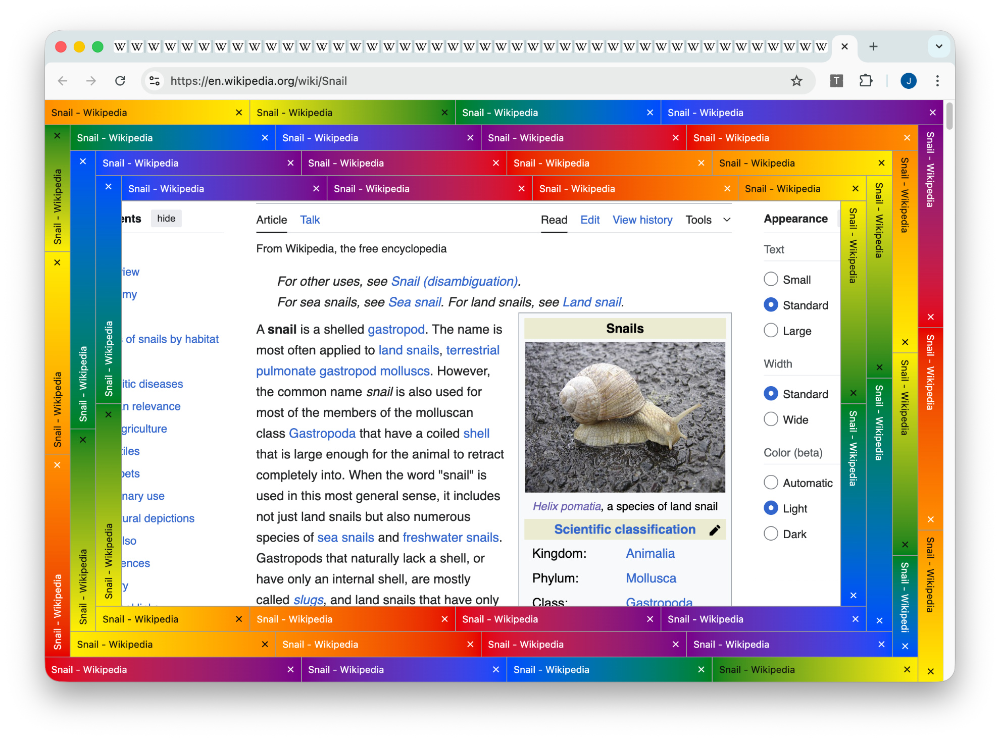

# Tabsnail 🐌

[](https://github.com/grubersjoe/tabsnail/actions/workflows/test.yml)

This project is a **work in progress** to bring [Fiona's](https://runjak.codes/) brilliant idea to
life: display your web browser's tab bar in a snail-like layout around the page.

- 🐌 Navigate between your tabs using an intuitive snail-layout
- 😵‍💫 Feel naturally discouraged from tab hoarding as the snail grows
- 💅 Pick your favorite snail color theme
- ⚙️ Customize colors and the tab bar size
- 🤓 The viewport automatically adjusts to fit inside the snail



Currently, Chrome and Firefox are supported. Because it is not published yet, you need to build and
install the extension yourself if you want to use it (see [development](#development)).

## Roadmap

- [x] Migrate to [WXT](https://wxt.dev) for cross-browser support
- [ ] Use [Svelte](https://svelte.dev) for rendering (in progress)
- [x] Show all tabs in snail form
- [x] Navigation
- [x] Close tabs
- [x] Shrink viewport to inner snail bounds
- [x] Update layout on viewport changes
- [x] Configurable tab size
- [ ] Tab groups
- [ ] Themes [inspiration](https://www.instagram.com/p/DMdTtUJpaxi)
  - [x] Striped (default) with color setting
  - [x] Pride
  - [x] Windows 95
  - [ ] Leopard Slug
  - [ ] Pacific Banana Slug
  - [ ] Red Slug
  - [ ] Sea Slug
  - [ ] Carpathian Blue Slug
  - [ ] Yellow Slug?

## Development

This project uses [WXT](https://wxt.dev). To start the extension in development mode, run one of the
following commands. The extension will launch in an isolated Chrome or Firefox window (Chrome by
default) and automatically reload on changes.

```shell
pnpm dev # each command uses Chrome by default
pnpm dev:chrome
pnpm dev:firefox
```

Alternatively, you can install the extension in your browser manually by loading the respective
directory in `./build` as an
[unpacked extension](https://developer.chrome.com/docs/extensions/get-started/tutorial/hello-world#load-unpacked).

Other helpful commands:

```shell
pnpm check # checks all things below
pnpm format
pnpm lint
pnpm tsc
```

Tests will be added soon.

## Publishing

To build in production mode, run:

```shell
pnpm build
pnpm build:chrome
pnpm build:firefox
```

You can create zip files with:

```shell
pnpm zip
pnpm zip:chrome
pnpm zip:firefox
```

Licensed under the
[Non-White-Heterosexual-Male License](https://nonwhiteheterosexualmalelicense.org).
