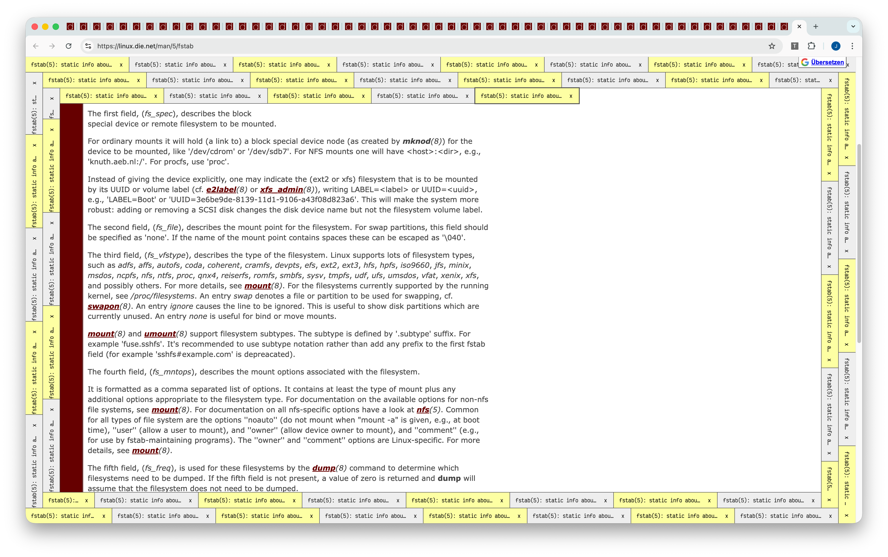

# Tabsnail

This is a **work in progress** to make a great idea of [Fiona](https://runjak.codes/) a reality:
showing all your browser tabs in snail form around the page. The more tabs you have open, the more
snail you get.

## TODO

- [x] Show all tabs in snail form
- [x] Navigation
- [x] Close tabs
- [ ] Shrink website viewport to inner snail bounds
- [x] Update layout on viewport changes
- [x] Configurable tab size
- [ ] [Themes](https://www.instagram.com/p/DMdTtUJpaxi)
  - [x] default (striped) with color setting
  - [ ] Windows 95
  - [ ] Leopard Slug
  - [ ] Pacific Banana Slug
  - [ ] Red Slug
  - [ ] Sea Slug
  - [ ] Carpathian Blue Slug
  - [ ] Yellow Slug?
- [ ] Visualize tab groups?
